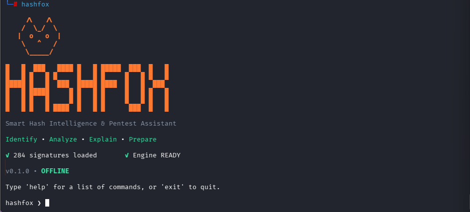
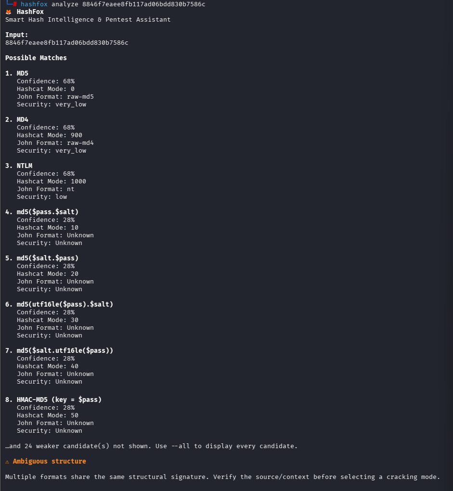
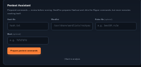
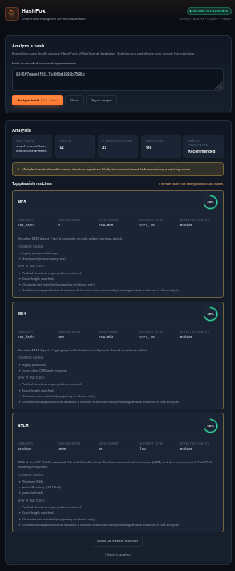

# 🦊 HashFox

### Smart Hash Intelligence & Pentest Assistant

**Identify • Analyze • Explain • Prepare**

HashFox is an open-source, offline hash intelligence and pentest assistance tool built with Python and FastAPI.

It analyzes unknown hash representations against a comprehensive local format database, ranks plausible matches using confidence-based detection, explains ambiguity instead of blindly guessing a format, and prepares ready-to-review Hashcat and John the Ripper commands.

> **Offline by design:** Hash analysis is performed locally. HashFox does not need to send submitted hashes to external identification services.

<p align="center">
  
</p>

---

## ✨ Features

- 🔍 **Hash Identification** — identifies plausible hash formats using structural characteristics.
- 🧠 **Confidence Scoring** — ranks candidates instead of blindly selecting one format.
- ⚠️ **Ambiguity Detection** — explicitly warns when multiple formats share the same structure.
- ⚔️ **Pentest Assistant** — prepares Hashcat and John the Ripper commands.
- 🗃️ **Offline Database** — 284 hash-format records available locally.
- 💻 **Interactive CLI** — terminal interface with analysis, lookup, scanning, and web-server commands.
- 🌐 **Web Interface** — responsive local interface powered by FastAPI.
- 🧪 **Tested Architecture** — automated tests for the detector, scoring engine, API, CLI, banner, and assistant.

---

## 🔍 Confidence-Based Hash Analysis

HashFox does more than compare hash length.

The detection engine evaluates available evidence such as:

- prefixes
- regular expressions
- hash length
- character sets
- separators
- known format structure
- database metadata

It then produces ranked candidates with confidence scores.

For example, a 32-character hexadecimal string cannot safely be declared MD5 based on appearance alone. The same structure can represent MD4, NTLM, and several other formats.

HashFox preserves that ambiguity instead of reporting false certainty.

### CLI Analysis

<p align="center">
  
</p>

Example:

```bash
hashfox analyze 8846f7eaee8fb117ad06bdd830b7586c
```

HashFox identifies MD5, MD4, and NTLM as equally plausible high-ranking candidates and warns that source context is required before selecting a cracking mode.

---

## ⚔️ Pentest Assistant

HashFox can turn analysis results into ready-to-review Hashcat and John the Ripper commands.

```bash
hashfox analyze 8846f7eaee8fb117ad06bdd830b7586c --pentest
```

Example prepared commands:

```bash
hashcat -m 1000 -a 0 hash.txt /usr/share/wordlists/rockyou.txt
```

```bash
john --format=nt --wordlist=/usr/share/wordlists/rockyou.txt hash.txt
```

The assistant can provide:

- Hashcat mode
- John the Ripper format
- recommended attack approaches
- recommended wordlists
- rule-based command preparation
- mask attack preparation
- contextual verification guidance

> HashFox prepares commands for review. It does **not** automatically execute Hashcat or John the Ripper.

### Pentest Assistant Interface

<p align="center">
  
</p>

---

## 🌐 Web Interface

HashFox includes a responsive local web interface backed by FastAPI.

Start it with:

```bash
hashfox serve
```

Then visit the local address printed by HashFox.

The interface provides:

- hash analysis
- ranked candidate cards
- confidence percentages
- ambiguity warnings
- Hashcat mode information
- John format information
- security metadata
- recommended attacks
- Pentest Assistant command preparation

<p align="center">
  
</p>

---

## 🗃️ Offline Hash Database

HashFox uses a comprehensive local database generated and validated by the project tooling.

Current database statistics:

| Property | Count |
|---|---:|
| Format records | **284** |
| Entries with examples | **204** |
| Verified John formats | **61** |
| Prefix hints | **66** |
| Entries with length information | **122** |
| Entries with aliases | **17** |
| Entries with variants | **22** |

Detection-quality distribution:

| Detection Quality | Records |
|---|---:|
| High | 66 |
| Medium | 118 |
| Reference only | 100 |

The database covers formats across categories such as:

- raw hashes
- Windows authentication
- Unix password hashes
- Kerberos
- databases
- network protocols
- wireless authentication
- archives
- Office documents
- disk encryption
- CMS platforms
- HMAC
- KDFs
- cryptocurrency
- application-specific formats

Some binary/container formats are retained as reference records even when reliable automatic identification from a plain-text representation is not possible.

---

## 🚀 Installation

### 1. Clone HashFox

Using HTTPS:

```bash
git clone https://github.com/vaniliaaa/hashfox.git
cd hashfox
```

Or SSH:

```bash
git clone git@github.com:vaniliaaa/hashfox.git
cd hashfox
```

### 2. Create a virtual environment

```bash
python3 -m venv .venv
source .venv/bin/activate
```

### 3. Install

```bash
python -m pip install -e .
```

### 4. Verify

```bash
hashfox --version
```

Expected output:

```text
HashFox 0.1.0
```

---

## 🦊 Usage

### Start the interactive console

```bash
hashfox
```

Interactive prompt:

```text
hashfox ❯
```

### Analyze a hash

```bash
hashfox analyze HASH
```

Example:

```bash
hashfox analyze 8846f7eaee8fb117ad06bdd830b7586c
```

### Enable Pentest Assistant

```bash
hashfox analyze HASH --pentest
```

### Display all plausible candidates

```bash
hashfox analyze HASH --all
```

### Scan hashes from a file

```bash
hashfox scan hashes.txt
```

### Look up a format

```bash
hashfox lookup MD5
```

### Launch the web application

```bash
hashfox serve
```

### Display help

```bash
hashfox --help
```

---

## 🧩 Architecture

```text
HashFox/
├── backend/
│   ├── analyzer.py
│   ├── app.py
│   ├── banner.py
│   ├── cli.py
│   ├── database.py
│   ├── detector.py
│   ├── pentest.py
│   ├── scoring.py
│   └── utils.py
│
├── database/
│   └── hashes.json
│
├── frontend/
│   ├── index.html
│   ├── style.css
│   ├── script.js
│   └── favicon.svg
│
├── tools/
│   ├── build_hash_database.py
│   ├── enrichment.py
│   └── raw_hashcat_modes.py
│
├── tests/
├── docs/
│   └── images/
├── pyproject.toml
├── requirements.txt
└── README.md
```

### Analysis Pipeline

```text
                    Unknown Hash
                         │
                         ▼
                 Offline Database
                         │
                         ▼
                Structural Detector
                         │
                         ▼
                Confidence Scoring
                         │
                         ▼
                 Ranked Candidates
                    │           │
                    ▼           ▼
               Analysis     Pentest Assistant
                                │
                         ┌──────┴──────┐
                         ▼             ▼
                      Hashcat         John
```

---

## 🧪 Testing

Run the complete test suite:

```bash
python -m pytest -v
```

The suite covers:

- hash detection
- confidence scoring
- ambiguous structures
- analyzer behavior
- Pentest Assistant
- Hashcat/John command generation
- malformed and Unicode input
- shell metacharacter handling
- API validation
- CLI behavior
- interactive console
- terminal banner rendering
- deterministic results
- static web assets

Current development test suite:

```text
125 passed
```

---

## 🔐 Design Philosophy

### Don't overclaim certainty

A structural match is evidence, not proof.

### Preserve ambiguity

If multiple formats have indistinguishable structures, HashFox reports multiple candidates instead of arbitrarily choosing one.

### Context matters

The source of a hash — operating system, application, database, protocol, or authentication mechanism — can be necessary for correct identification.

### Prepare, don't execute

Pentest Assistant prepares commands that the user can review. HashFox does not automatically launch password-cracking operations.

### Offline by design

Hash intelligence and analysis operate against the project's local database.

---

## 🛠️ Tech Stack

**Backend**

- Python
- FastAPI
- Pydantic
- Uvicorn

**CLI**

- Python
- Rich

**Frontend**

- HTML
- CSS
- JavaScript

**Testing**

- Pytest
- HTTPX

**Supported external tooling**

- Hashcat
- John the Ripper

---

## 🗺️ Roadmap

Potential future improvements include:

- broader high-confidence format enrichment
- expanded John the Ripper coverage
- additional structural signatures
- contextual detection hints
- improved batch analysis
- exportable reports
- additional CLI output formats

---

## ⚠️ Responsible Use

HashFox is intended for authorized security work, cybersecurity education, CTF environments, security research, and password auditing on systems you own or have explicit permission to test.

Users are responsible for ensuring that their use complies with applicable laws and authorization requirements.

---

## 🤝 Contributing

Contributions, bug reports, and feature suggestions are welcome.

When adding detection rules, avoid rules that claim certainty based solely on ambiguous structural characteristics. New functionality should include appropriate tests.

---

## 📄 License

This project is licensed under the MIT License.

---

<p align="center">
  <strong>🦊 HashFox</strong><br>
  <em>Follow the hash trail.</em>
</p>
